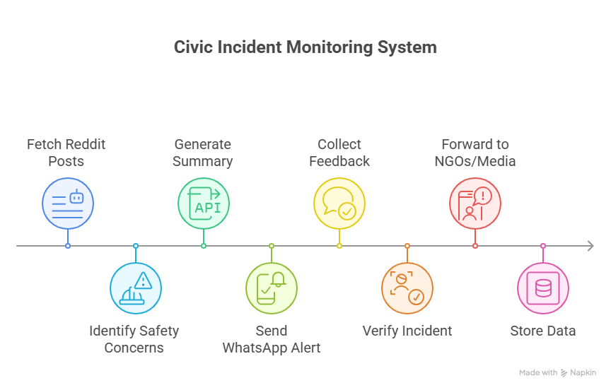

# AidConnect: Autonomous Incident Detection and Aid Dissemination using Agentic AI

> *“Instead of victims searching for help — we built a system where help finds them.”*

---

## Overview

**AidConnect** (Originally named AlertKarachi) is an **autonomous AI-powered system** designed to identify, verify, and route real-world incidents (e.g., crimes, accidents, emergencies) from social media directly to the relevant authorities, NGOs, and media outlets after verification.  

The goal is to **bridge the gap between affected individuals and support organizations**, ensuring that help reaches victims faster and more efficiently.  

This project was built as part of a **Built With AI Hackathon funded by Google Developer Groups**, where it secured **2nd Position** for its innovation and real-world impact.

---

## 💡 Problem Statement

In many underprivileged areas, people lack awareness about where and how to seek help during emergencies.  
For instance, when a family loses its breadwinner during a robbery, they might file an FIR(First Information Report) to nearest police station but have no access to or knowledge of NGOs, financial support, or media coverage.  

According to official reports, only 2% of such incidents receive media attention, leaving countless cases unnoticed and unaided.  

Meanwhile:
- **NGOs** are actively searching for genuine cases to support.  
- **Media outlets** look for real human-impact stories.  
- **Victims** post their problems on social media but never reach structured help.  

AidConnect fills all these gaps using Agentic AI.

---

## 🚀 Solution

AidConnect is a fully autonomous **multi-agent AI system** that continuously monitors and analyzes social media discussions to detect ongoing or emerging incidents.  

### How It Works:
1. **Data Scraping:**  
   Using Social Media APIs, the system gathers posts related to distress events (crimes, emergencies, etc.) being discussed by multiple users.

2. **AI Summarization:**  
   The collected data is processed by Gemini AI, which extracts key insights and generates a short, structured incident summary.

3. **Verification:**  
   The system autonomously sends this summary to the relevant department (e.g., police) via WhatsApp Business API to confirm the authenticity of the report.

4. **Dissemination:**  
   Once verified, the incident is automatically shared with NGOs and media outlets, enabling them to take timely action.

5. **Outcome:**  
   - Victims receive faster aid and visibility.  
   - NGOs discover verified cases efficiently.  
   - Media gains credible human stories to highlight.  

> The entire process, from detection to dissemination, runs autonomously through coordinated AI agents.

---

## Key Innovations

- **Autonomous Agentic AI Workflow:**  
  No manual intervention, incidents are detected, verified, and routed automatically and displayed on a dashboard.  

- **Reverse Aid-Seeking Model:**  
  Traditional systems expect victims to find help; AidConnect brings help to them.  

- **Cross-Platform Integration:**  
  Combines multiple APIs, Social Media, WhatsApp, Firebase, into a seamless workflow.  

- **Multi-Stakeholder Connectivity:**  
  Bridges the communication gap between the public, NGOs, media, and law enforcement.  

- **AI-Powered Verification and Summarization:**  
  Uses Gemini AI to transform noisy, unstructured data into verified actionable insights.

---

## 🏗️ System Architecture

    

 

---

<!-- ## Technologies Used

| Category | Technologies |
|-----------|---------------|
| Programming Language | Python |
| AI & NLP | Gemini AI |
| APIs | Twitter API, Facebook Graph API, WhatsApp Business API |
| Backend | Firebase Studio |
| Architecture | Agentic AI (Autonomous Multi-Agent System) |
| Data Processing | Python Requests, JSON, REST APIs |
| Storage | Firebase Realtime Database |
| Communication | WhatsApp API, Email Automation |
| Deployment | Firebase Hosting / Cloud Functions |

--- -->

## ⚙️ Features

✅ Real-time incident detection from social media  
✅ Automatic AI summarization and classification  
✅ Autonomous verification with relevant departments  
✅ Instant dissemination to NGOs and media outlets  
✅ Scalable Firebase backend  
✅ Fully automated end-to-end workflow  

---

## 🔥 Achievement

🏆 **Secured 2nd Position** at Built With AI Hackathon funded by Google Developer Groups,  
recognizing innovation, technical excellence, and social impact.

---

## Future Enhancements

- Add **geolocation mapping** for region-based response prioritization.  
- Integrate **multilingual AI models** to detect regional posts in local languages.  
- Introduce a **public dashboard** for NGOs and journalists to track verified incidents.  
- Use **LLM-powered sentiment and severity analysis** for incident prioritization.  
- Expand integration with **government emergency and disaster management systems**.

---

## ☁️ Role of Firebase Studio

**Google Firebase Studio** was central to development and deployment:
- Provided a **real-time database** for storing incident data and verification logs.  
- Enabled **fast API communication** between AI agents and end-users.  
- Simplified **authentication and security** for sensitive workflows.  
- Supported **scalable cloud deployment** without managing heavy infrastructure.  
- Allowed rapid **prototyping** and iteration during the hackathon.

---

<!-- ## 👥 Team InnovAid

| Name | Role | Responsibilities |
|------|------|------------------|
| [Your Name] | Lead Developer | System architecture, AI agent integration |
| [Teammate 1] | Backend Engineer | Firebase setup, API handling |
| [Teammate 2] | AI Specialist | Gemini prompt optimization, summarization pipeline |
| [Teammate 3] | UI/UX & Communications | Workflow design, presentation & pitch |

--- -->

<!-- ## 🧾 License

This project is licensed under the **MIT License** — free to use, modify, and distribute with proper attribution.

--- -->

## Acknowledgments

Special thanks to:
- **Google** for funding and organizing the Hackathon  
- **Firebase Team** for providing powerful developer tools  
- **Mentors & Judges** for recognizing the innovation behind AidConnect  

---

### ⭐ If you found this project inspiring, consider giving it a star on GitHub!  

<!-- ---
# Firebase Studio

This is a NextJS starter in Firebase Studio.

To get started, take a look at src/app/page.tsx.

## Alert Karachi 
This project was developed during BWAI Hackathon  -->